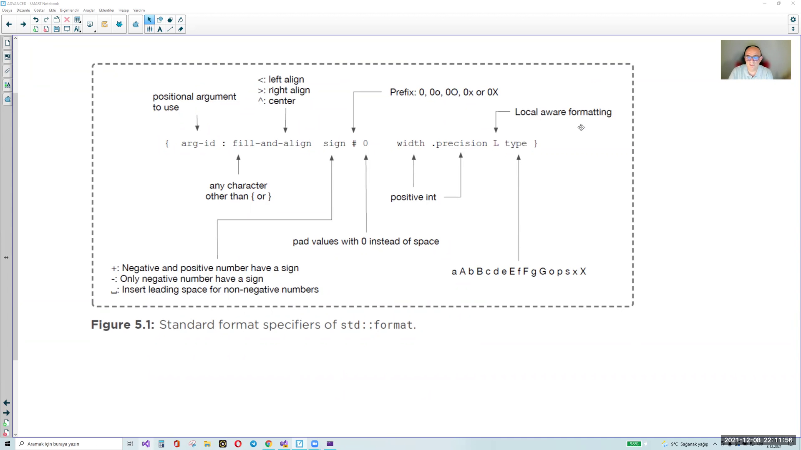
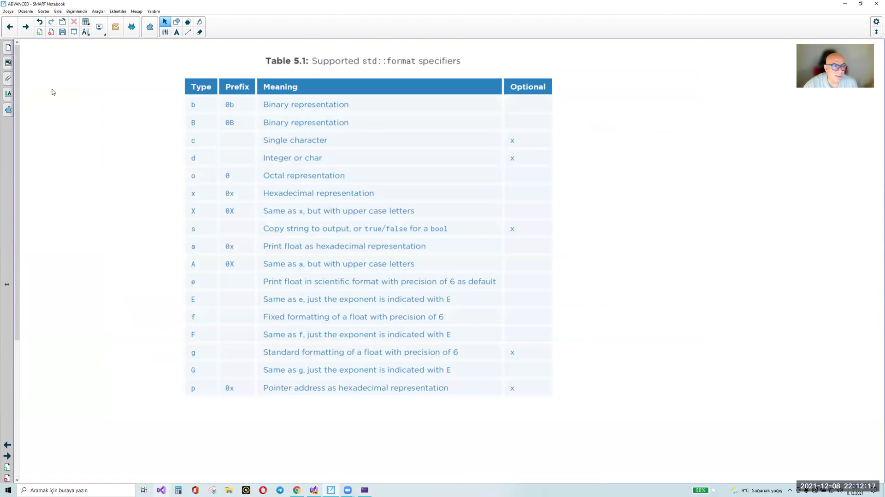

# std::format (C++20)

> pattern su  
>  **[ fill ][ alignment ][ sign ][ # ][ 0 ][ width ][ .prec ][ L ][ type ]**

## printf
  - [+] okunabilir
  - [+] cok hizli (ozellikle iostream ile karsilastirildiginda)
  - [-] type-safe degil
  - [-] user-defined type lar icin kullanilamaz
  - [+] local-dependent (setlocal, dillere gore farkli)

## iostream
  - [-] interface i cok kotu, C++ in en cok elestirilen kutuphanesi
  - [-] hantal, yavas
  - [-] okunmasi zor
  - [-] formatlama ve argumanlar birbirinde ayri degil
  - [+] user-defined type icin extensible  
        kendi sinifimiz icin operator<< yazilabilir

## std::format
  - type safe 
  - hizli calisir
  - extensible for user-defined types
  - localizable, translatable
  - readable

  _ex_
  ```cpp
    using namespace std;

    time_t timer;
    time(&timer);
    auto p = localtime (&timer);

    ostringstream oss;

    // format soyle olsun: 02_05_1987_14_52_45
    
    oss << setw(2) << setfill('0') << p-> tm_mday << "_" >> ...;

    // yazmasi zor
  ```

> std::format, iostream ve printf deki defficiency lere sahip degil ve efficient 

## intro
- baslik dosyasi format.hpp
- std::format()
  * return type: string
  * input parametresinin type i derleyiciye bagli, ancak **compile-time** da ``string_view``'e donusturulebilebilir bir tur olmak zorunda  
*=> " parameter of unspecified type, whose initialization is valid only if the argument is convertible to std::string_view (for (1,3)) or std::wstring_view (for (2,4)), and the result of conversion is a constant expression and a valid format string for Args"*
  
> input parametresi compile time oldugu icin derleyici her turlu kontrolu yapabiliyor.  
> Note: compile-time da belirli hatalarin bulunmasi garantisi c++20 sonrasi geldi

  _ex_
  ```cpp
    #include <format>

    int main()
    {
        auto s = std::format();     // can be stored as a string

        cout << std::format();      // cikis akimina verilebilir since
                                    // the return type is string
    }
  ```

  _ex_
  ```cpp
    #include <format>

    int main()
    {
        auto s = std::format("kadir c++ programcisidir");

        cout << std::format("kadir c++ programcisidir") << "\n";
    }
  ```

### "{}" placeholder -> formatlama bilgisini icerir 
  - formatlama bilgisi yazilmadiginda "default formatlama" ozelligi kullanilir.
   

  _ex:_ default format for integer types is 10-base
  ```cpp
    #include <format>

    int main()
    {
        std::string name{"necati"}
        int cnt{20};


        std::cout << std::format("{} kisisinin {} kitabi var", name, cnt) << "\n";
    }
  ```

  _ex_
  ```cpp
    cout << format("{} {}\n", "merhaba", "dunya");
  ```

### index berlirtebiliriz
  _ex_
  ```cpp
    
    cout << format("{1} kisisinin {0} kitabi var\n", cnt, name); // name cnt
        // necati kisisinin 20 kitabi var
    
    cout << format("{} kisiisnin {} kitabi var\n", cnt, name); 
        // 20 kisisinin necati kitabi var

  ```

### ayni arguman birden fazla kez kullanilabilir
  _ex_
  ```cpp
    int x = 47802;

    cout << format("{0} {0} {0}", x);

    
    cout << format("{0:b} {0:x} {0}", x);
  ```

### kume parantezi icine formatlama ozelligi girilebilir
  _ex_
  ```cpp
    cout << format("{0:b} {0:x} {0:X}  {0:d} {0:o}", x);
        - binary, hexadecimal, decimal, onluk
  ```

### genel yapi
  - {}      -> default 
  - {n}     -> default, index
  - {:fmt}  -> formatlama nitelikleri ile formatlanacak
  - {n:fmt} -> index, formatlama bilgisi

## **format specifier**
  - printf de oldugu gibi bir takim bilesenler var
  - genellikle opsiyonel
  - bazilari digerlerinin varligini gerektirir

> pattern su
>  [ fill ][ alignment ][ sign ][ # ][ 0 ][ width ][ .prec ][ L ][ type ]

|representation | explanation |
|:-- | :-- |
|fill      |doldurma karakteri, default space |
|alignment |sag, sol, centered|
|sign      |isaretin format bilgisi, ex: "+" gosterrilsin mi?|
|[#]       |bazi formatlama bilgilerinde tamamlayici ozellik olarak kullanilir, ex: sayi sistemi tabani gosterilsin mi?|
|0 (padding zero) |yazma alaninin basini 0 ile doldursun mu? (mesela int yazarken)|
|width     |output width| 
|.prec     |precision|
|L         |localization properties|
|type      |also includes number base info|


## indexing
    - fazla arguman olmasi bir hata degil
      ancak belirli hatalar runtimeda exception a sebep olur
    - compile time da bulunamayan hatalar exception throw eder

  _ex:_
  ```cpp
    cout << format("{} {} {}\n", "Arda", "Ozlem", "Melih");
    
    cout << format("{1} {0} {2}\n", "Arda", "Ozlem", "Melih");
            // Ozlem Arda Melih
   
    cout << format("{2} {1} {0}\n", "Arda", "Ozlem", "Melih");
            // Melih Ozlem Arda

    cout << format("{2} {1} {0}\n", "Arda", "Ozlem", "Melih", "Tuncay"); // ok
    
    
    int x = 47802;
    cout << format("{0:b} {0:x} {0:o}\n", x);
            // 101010... baba 13.. 
  ```

### pozisyonel indexleme ile manuel indexleme birarada kullanilamaz
  _ex_
  ```cpp
    // hata compile-time da yakalanamadi, run time hatasi verdi
    
    try (const std::exception& ex){
        cout << format("{1} {0} {}\n", "Arda", "Ozlem", "Melih");
    } catch {
        cout << ex.what();
    }

    // 2020 sonrasi standard da compile-time da yakalanabilen butun hatalar icin garanti verilecek
  ```

  _ex_
  ```cpp
    int x = 723423423;

    cout << format("|{}|\n", x);    // 10 luk sistem
    
    cout << format("|{0}|, |{0:d}|\n", x);    // 10 luk sistem
    
    cout << format("|{0:x}|, |{0:X}|\n", x);    // kucuk/buyuk harf hexadecimal
                                                // 6e...

    cout << format("|{0:#x}|, |{0:#X}|\n", x);    // 0x[kucuk/buyuk harf hexadecimal]
                                                  // 0x6e...

    cout << format("|{0:o}|, |{0:#o}|\n", x);     //octal, 0+octal
                                                  // 3347..., 03347...
    
    cout << format("|{0:b}|, |{0:#b}|, |{0:#B}|\n", x);   // 10001, 0b1001.., 0B101010 
  ```

### boolean degerler icin default deger: true, false
  1, 0 degil

  _ex_
  ```cpp
    cout << format("{} {}\n", true, false);         // true, false  (default, 1 degil)
    
    cout << format("{:s} {:s}\n", true, false);     // true, false
    
    cout << format("{:b} {:b}\n", true, false);     // 1, 0

    cout << format("{:#b} {:#b}\n", true, false);     // 0b1, 0b0
    
    cout << format("{:#rBb} {:#B}\n", true, false);   // 0B1, 0B0
    
    cout << format("{:x} {:x}\n", true, false);       // 1 0 
    
    cout << format("{:#x} {:#x}\n", true, false);     // 0x1 0x0
    
    cout << format("{:#X} {:#X}\n", true, false);     // 0X1 0X0
  ```

## format specifiers: table and pictures for explanation
format_specifiers


supported_format_specifiers


### gercek sayi
  _ex_
  ```cpp
    double dval = 1234.78981232;

    cout << format("{:f}\n", dval); // fixed 12323.1321312

    cout << format("{:e}\n", dval); // scientific: 7.812322e+11
    cout << format("{:E}\n", dval); // scientific: 7.81232E+11
  ```

### string
  _ex:_
  ```cpp
    cout << format("{}\n", "necati ergin");
    
    cout << format("{:s}\n", "necati ergin");
    
    cout << format("{:s}\n", 10 > 5);
  ```

## Hizalama
  _ex:_
  ```cpp
    int x = 8765;

    cout << format("{:18}{}", x, "ali") << "\n";    // x i 18 karakterlik alan
                                                    // fill char = space

    // hizalama
    format("{:<18}{}", x);      // x i 18 karakter, sola dayali (<-)
                                // |8765             |

    format("{:>18}{}", x);      // x i 18 karakter, saga dayali (->)
                                // |             8765|
    
    format("{:^18}{}", x);      // x i 18 karakter, orta
                                // |     8765        |

    // fill char
    format("{:.<18}{}", x);      // x i 18 karakter, sola dayali (<-)
                                 // |8765.............|

    format("{:.>18}{}", x);      // x i 18 karakter, saga dayali (->)
                                 // |.............8765|
    
    format("{:.^18}{}", x);      // x i 18 karakter, orta
                                // |.....8765........|
  ```

## Precision
  _ex_
  ```cpp
    // precision
    cout << format("{:6}{}", "necati ergin");   // 6 -> yazma alani genisligi
                                                // necati ergin
    
    cout << format("{:.6}{}", "necati ergin");  // 6 -> precision
                                                // necati
                                                // sadece 6 karakter yazdir

    cout << format("{:.3}{}", "necati ergin");  // 3 -> precision
                                                // nec
   
    int x = 5;
    cout << format("{:.{}}{}", "necati ergin", x);    // precisioni belirleyen x
                                                      // necat

    int x = 762374;
    cout << format("{:15x}\n", x);    // 15 karakterlik alana hexadecimal 
    
    cout << format("{:#15X}\n", x);   // 15 karakterlik alana hexadecimal 
                                      // 0X23123

    cout << format("{:<#15X}\n", x);    // 15 karakterlik alana hexadecimal 
                                        // sola dayali

    cout << format("{:_<#15X}\n", x);   // 15 karakterlik alana hexadecimal 
                                        // sola dayali
                                        // fill char: _

    cout << format("{:->#15X}\n", x);   // 15 karakterlik alana hexadecimal 
                                        // saga dayali dayali
                                        // fill char: -
                                        //  ------0X53D..
  ```

## Sign
  _ex_
  ```cpp
    cout << format("|{0}|\n", 94);    // index 0
                                      // pozitif deger default olarak "+" sign i koymaz
                                      // |94|
    
    cout << format("|{0}|\n", -94);   // index 0
                                      // negatif deger default olarak "-" sign i koyar
                                      // |-94|
    
    cout << format("|{0}| {0:-}\n", 94);  // - isaretini goster (zaten default)
                                            // pozitif deger
                                            // |94| |94|
    
    cout << format("|{0}| |{0:-}|\n", -94); // - isaretini goster
                                            // negatif deger
                                            // |-94| |-94|
                                                
    cout << format("|{0}| |{0: }|\n", 94);    // space char " "
                                              // pozitifse bosluk gonder
                                              // |94|, | 94|

    cout << format("|{0}| |{0: }|\n", -94);   // space char " "
                                              // pozitifse bosluk gonder
                                              // |-94|, |-94|
  ```